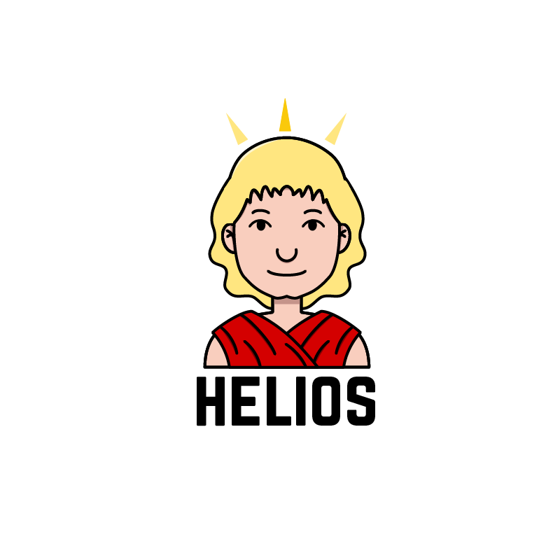

[](https://codeclimate.com/github/IcaliaLabs/helios)
[](https://codeclimate.com/github/IcaliaLabs/helios/coverage)
[](https://codeclimate.com/github/IcaliaLabs/helios)


<div style="text-align:center">
  
</div>

Helios is an open source ruby gem that acts as a wrapper for IBM Watson's [Tone analyzer service API](https://www.ibm.com/watson/developercloud/tone-analyzer.html).

## Installation

Add this line to your application's Gemfile:

```ruby
gem 'helios-bot'
```

And then execute:

    $ bundle

Or install it yourself as:

    $ gem install helios-bot

## Usage

### Configuration

In order for Helios to work correctly, it is important that you [set up an IBM Bluemix account of your own](https://console.ng.bluemix.net/) and that your trial period hasn't ended (or, for that matter, that you've registered for a paid account)

First require the `helios-bot` in your file:

```ruby
require 'helios-bot'
```

Then add the following configuration block:

```ruby

Helios::Bot.configure do |config|
	config.username = SOME_USERNAME
	config.password = SOME_PASSWORD
	config.base_uri = "https://gateway.watsonplatform.net/tone-analyzer/api/v3"
end
```

**Note: The username and password are not your Bluemix credentials. These
credentials are specific to the Tone Analyzer API and must
be obtained from said section of Watson's Docs**

## Development

After checking out the repo, run `bin/setup` to install dependencies. Then, run `rake spec` to run the tests. You can also run `bin/console` for an interactive prompt that will allow you to experiment.

To install this gem onto your local machine, run `bundle exec rake install`. To release a new version, update the version number in `version.rb`, and then run `bundle exec rake release`, which will create a git tag for the version, push git commits and tags, and push the `.gem` file to [rubygems.org](https://rubygems.org).

## Contributing

Bug reports and pull requests are welcome on GitHub at https://github.com/[USERNAME]/helios-bot. This project is intended to be a safe, welcoming space for collaboration, and contributors are expected to adhere to the [Contributor Covenant](http://contributor-covenant.org) code of conduct.


## License

The gem is available as open source under the terms of the [MIT License](http://opensource.org/licenses/MIT).
